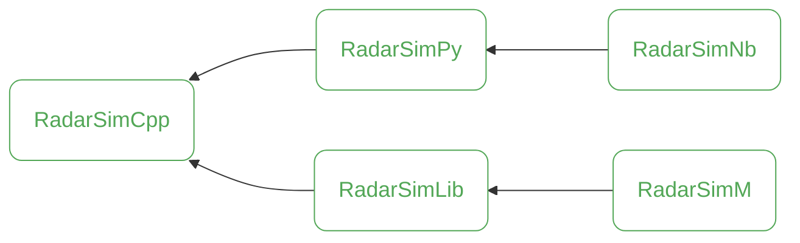

# RadarSimNb


`RadarSimNb` is a repository containing Jupyter Notebooks that provide detailed, hands-on examples for using `RadarSimPy`. These notebooks serve as a practical guide to help you get started quickly and effectively. Explore the [examples](https://radarsimx.com/category/examples/) to dive in!



## Creating a Codespace with Ubuntu 22.04 and VSCode

To create a codespace with Ubuntu 22.04 and VSCode, follow these steps:

1. Open your repository on GitHub.
2. Click on the "Code" button and select "Open with Codespaces".
3. If you don't have any existing codespaces, click on "New codespace".
4. Select the "Ubuntu 22.04" image.
5. Click on "Create codespace".

## Installing VSCode, Python, and PyTorch

Once your codespace is created, you can install VSCode, Python, and PyTorch by following these steps:

1. Open the terminal in your codespace.
2. Install Python by running the following command:
   ```sh
   sudo apt-get update
   sudo apt-get install -y python3 python3-pip
   ```
3. Install VSCode extensions for Python and PyTorch:
   ```sh
   code --install-extension ms-python.python
   code --install-extension ms-toolsai.jupyter
   code --install-extension ms-pyright.pyright
   ```
4. Install PyTorch by running the following command:
   ```sh
   pip3 install torch torchvision torchaudio
   ```
